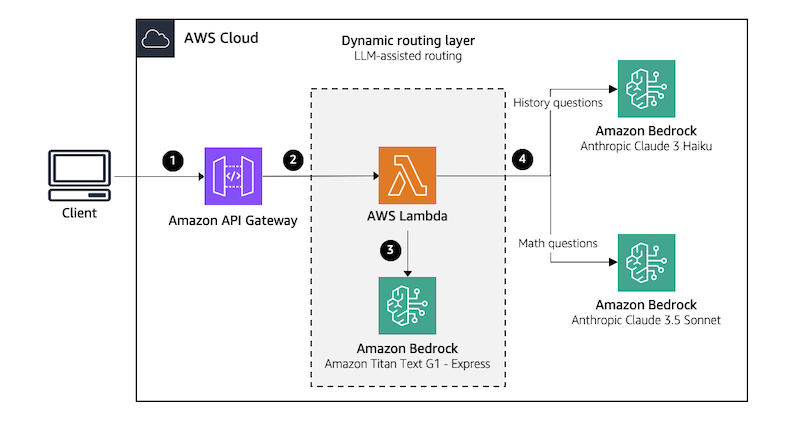

# LLM-assisted Routing

LLM-assisted routing employs a classifier LLM at the application's entry point for routing decisions. LLM's ability to comprehend complex patterns and contextual subtleties makes this approach well-suited for applications requiring fine-grained classifications across task types, complexity levels, or domains. 

## Solution architecture

In this solution, we demonstrate an educational tutor chatbot that helps students in two domains of history and math. To implement the routing layer, application leverages Amazon Titan Text G1 - Express model on Bedrock to classify the questions based on their topic to either history or math. History questions are routed to a more cost-effective and faster LLM such as Anthropic Claude 3 Haiku on Bedrock. While math questions are handled by a more powerful LLM, such as Anthropic Claude 3.5 Sonnet on Bedrock, which is better suited for complex problem-solving, in-depth explanations, and multi-step reasoning. If the classifier LLM is unsure whether a question belongs to the history or math category, it defaults to classifying it as math. 

The architecture of this system is illustrated in the following diagram.

**Note:** The provided code in this repository is meant to be used in a development environment. Before migrating any of the provided solutions to production, we recommend following the [AWS Well-Architected Framework](https://aws.amazon.com/architecture/well-architected)



This architecture workflow includes the following steps:
1.	A user submits a question through a web/mobile application, which then forwards the query to an [Amazon API Gateway](https://aws.amazon.com/api-gateway).
2.	When the API Gateway receives the request, it triggers an [AWS Lambda function](https://aws.amazon.com/lambda/).
3.	The Lambda function first sends the question to the classifier LLM to determine whether it is a history or math question.
4.	Based on the classifier LLM decision, the Lambda function then routes the question to the appropriate downstream LLM, which will generate an answer and return it to the user.

**Note:** The use of Amazon Titan and Anthropic Claude models on Bedrock in this solution is for demonstration purposes only. The code can be easily modified to work with other models, whether they are hosted on or outside of Bedrock.

## Prerequisites

The following are needed in order to proceed with this solution:
*	An [AWS account](https://aws.amazon.com/resources/create-account/)
*	The [AWS Cloud Development Kit (CDK)](https://docs.aws.amazon.com/cdk/v2/guide/getting_started.html) - [Bootstrap](https://docs.aws.amazon.com/cdk/v2/guide/ref-cli-cmd-bootstrap.html) your AWS account for CDK. This only needs to be done once per account/region
*	The [AWS Command Line Interface (AWS CLI)](https://aws.amazon.com/cli/)
*	[Amazon Bedrock model access](https://docs.aws.amazon.com/bedrock/latest/userguide/model-access-modify.html) enabled for Anthropic Claude 3 Haiku, Anthropic Claude 3.5 Sonnet, and Amazon Titan Text G1 - Express, and Amazon Titan Text Embeddings V2. Refer to [Model support by AWS region](https://docs.aws.amazon.com/bedrock/latest/userguide/models-regions.html) to check the model availability for your desired region.
*	[jq](https://jqlang.github.io/jq/) and [git](https://git-scm.com/)
*	curl commands (installed by default in Mac and Linux systems)
*	Python 3.9+ with pip package manager

## Deploy the solution

1. Clone the Amazon Bedrock samples Github repo to your development environment:

```
git clone https://github.com/aws-samples/sample-multi-llm-dynamic-prompt-routing.git
```

2. Navigate to the sample-multi-llm-dynamic-prompt-routing/llm-assisted-router sub-folder, create and activate the python virtual environment, and install dependencies:

```
cd sample-multi-llm-dynamic-prompt-routing/llm-assisted-router
python3 -m venv .venv
source .venv/bin/activate
python3 -m pip install -r requirements.txt
```

4. Now you can deploy the application.

```
cdk deploy
```

This creates the necessary infrastructure for the application within your default VPC in the default region you configured in your AWS CLI.

## Test the solution

You'll first need to retrieve the API ID, API key ID and API key value from the CloudFormation output. You can do this by running the following commands:

```
# Retrieve the API ID
export API_ID=$(aws cloudformation describe-stacks --stack-name LlmAssistedRouterStack --query "Stacks[0].Outputs[?OutputKey=='ApiId'].OutputValue" --output text)

# Retrieve the API key ID
export API_KEY_ID=$(aws cloudformation describe-stacks --stack-name LlmAssistedRouterStack --query "Stacks[0].Outputs[?OutputKey=='ApiKeyID'].OutputValue" --output text)

# Retrieve the API key value
export API_KEY_VALUE=$(aws apigateway get-api-key --api-key $API_KEY_ID --include-value | jq -r .value)
```
Now you can run the API call to generate a response. First, let’s ask a history question:

```
curl -X POST https://$API_ID.execute-api.us-east-1.amazonaws.com/dev/ask \
    -H 'Content-Type: application/json' -H "x-api-key: ${API_KEY_VALUE}" \
    -d '{"question":"What year did World War II end?"}'
```

The following output shows the response to the question “What year did World War II end?”. 

```
{
  "answer": "World War II ended in 1945.",
  "question_classification": "history",
  "classifier_LLM": "amazon.titan-text-express-v1",
  "classification_time": 0.5374360084533691,
  "answerer_LLM": "anthropic.claude-3-haiku-20240307-v1:0",
  "answer_generation_time": 0.2473313808441162,
  "total_response_time": 0.7847845554351807
}
```

The question was correctly classified as a history question, with the classification process taking approximately 0.53 seconds. The question was then routed to and answered by Anthropic's Claude 3 Haiku, which took around 0.25 seconds. In total, it took about 0.78 seconds to receive the response. 

Next, let’s ask a math question.

```
curl -X POST https://$API_ID.execute-api.us-east-1.amazonaws.com/dev/ask \
    -H 'Content-Type: application/json' -H "x-api-key: ${API_KEY_VALUE}" \
    -d '{"question":"Solve the quadratic equation: 2x^2 - 5x + 3 = 0"}'
```

The following output shows the response to the question “Solve the quadratic equation: 2x^2 - 5x + 3 = 0”. 

```
{
  "answer": "To solve this quadratic equation, we'll use the quadratic formula: x = [-b ± √(b² - 4ac)] / 2a\n\nWhere a = 2, b = -5, and c = 3\n\nSteps:\n1. Substitute values into the formula\n2. Simplify under the square root\n3. Calculate the two solutions\n\nx = [5 ± √(25 - 24)] / 4\nx = (5 ± √1) / 4\nx = (5 ± 1) / 4",
  "question_classification": "math",
  "classifier_LLM": "amazon.titan-text-express-v1",
  "classification_time": 0.5975513458251953,
  "answerer_LLM": "anthropic.claude-3-5-sonnet-20240620-v1:0",
  "answer_generation_time": 2.3191726207733154,
  "total_response_time": 2.9167449474334717
}
```

As we can see, the question was correctly classified as a math question, with the classification process taking approximately 0.59 seconds. The question was then correctly routed to and answered by Anthropic's Claude 3.5 Sonnet, which took around 2.3 seconds. In total, it took about 2.9 seconds to receive the response.

## Clean up

To avoid incurring additional charges while the solution is not being used, delete the infrastructure

```
cdk destroy
```