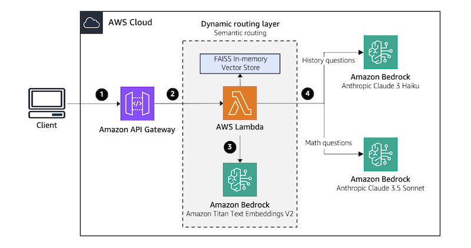

# Semantic Routing

This approach uses semantic search as an alternative to using a classifier LLM for prompt classification and routing in multi-LLM systems. Semantic search leverages embeddings to represent prompts as numerical vectors. The system then makes routing decisions by measuring the similarity between the user's prompt embedding and the embeddings for a set of reference prompts, each representing a different task category. The user prompt is then routed to the LLM associated with the task category of the reference prompt that has the closest match. 

## Solution architecture

In this solution, we demonstrate an educational tutor chatbot that helps students in two domains of history and math. To implement the routing layer, you first need to create a reference prompt set that represents the full spectrum of history and math topics you intend to cover. This set serves as the foundation for the semantic matching process, enabling the application to correctly categorize incoming queries. 

Next, you will leverage Amazon Titan Text Embeddings model to convert all prompts in the reference set into embeddings. These embeddings along with the corresponding topic metadata (i.e., history or math) for each question, are then saved in the in-memory FAISS vector store, which is deployed as a Lambda layer.    

Now, for every new question asked, you first convert the question into an embedding using Amazon Titan Text Embeddings model and then perform a similarity search against the reference index to find the closest matching question. The topic of the matched question is then used to make the routing decision. 

The architecture of this system is illustrated in the following diagram.

**Note:** The provided code in this repository is meant to be used in a development environment. Before migrating any of the provided solutions to production, we recommend following the [AWS Well-Architected Framework](https://aws.amazon.com/architecture/well-architected)



This architecture workflow includes the following steps:
1.	A user submits a question through a web/mobile application, which forwards the query to an Amazon API Gateway.
2.	When the API Gateway receives the request, it triggers an AWS Lambda function.
3.	The Lambda function first sends the question to the embedding LLM to convert it to an embedding. It then performs a similarity search on FAISS index to find the closest matching question in the reference index, and returns the corresponding category label. 
4.	Based on the retrieved category, the Lambda function then routes the question to the appropriate downstream LLM, which will generate an answer and return it to the user.

**Note:** The use of Amazon Titan and Anthropic Claude models on Bedrock in this solution is for demonstration purposes only. The code can be easily modified to work with other models, whether they are hosted on or outside of Bedrock. 

## Prerequisites

The following are needed in order to proceed with this solution:
*	An [AWS account](https://aws.amazon.com/resources/create-account/)
*	[AWS Cloud Development Kit (CDK)](https://docs.aws.amazon.com/cdk/v2/guide/getting_started.html) - [Bootstrap](https://docs.aws.amazon.com/cdk/v2/guide/ref-cli-cmd-bootstrap.html) your AWS account for CDK. This only needs to be done once per account/region
*	[AWS Command Line Interface (AWS CLI)](https://aws.amazon.com/cli/)
* [Docker](https://aws.amazon.com/docker/) - Only required during deployment for Docker-based bundling. 
*	[Amazon Bedrock model access](https://docs.aws.amazon.com/bedrock/latest/userguide/model-access-modify.html) enabled for Anthropic Claude 3 Haiku, Anthropic Claude 3.5 Sonnet, and Amazon Titan Text G1 - Express, and Amazon Titan Text Embeddings V2 in the us-east-1 Region
*	[jq](https://jqlang.github.io/jq/) and [git](https://git-scm.com/)
*	curl commands (installed by default in Mac and Linux systems)
*	Python 3.9+ with pip package manager

## Deploy the solution

1. Clone the Amazon Bedrock samples Github repo to your development environment:
```
git clone https://github.com/aws-samples/sample-multi-llm-dynamic-prompt-routing.git
```

2. Navigate to the sample-multi-llm-dynamic-prompt-routing/semantic-router sub-folder, create and activate the python virtual environment, and install dependencies:

```
cd sample-multi-llm-dynamic-prompt-routing/semantic-router
python3 -m venv .venv
source .venv/bin/activate
python3 -m pip install -r requirements.txt
```

3. Follow the steps in [Generate FAISS reference index](../generate-faiss-reference-index/README.md) to generate the reference index and refernece lables file and copy them under the [FAISS layer folder](./faiss_layer/) in your project root folder. This is already done for the provided sample reference prompts mentioned in [Generate FAISS reference index](../generate-faiss-reference-index/README.md). You need to re-do this if you want to try a different set of reference prompts.

4. Now you can deploy the application.

```
cdk deploy
```

This creates the necessary infrastructure for the application within your default VPC in the default region you configured in your AWS CLI.

## Test the solution

you'll first need to retrieve the API ID and API key ID and API key value from the CloudFormation output. You can do this by running the following commands:

```
# Retrieve the API ID
export API_ID=$(aws cloudformation describe-stacks --stack-name SemanticRouterStack --query "Stacks[0].Outputs[?OutputKey=='ApiId'].OutputValue" --output text)

# Retrieve the API key ID
export API_KEY_ID=$(aws cloudformation describe-stacks --stack-name SemanticRouterStack --query "Stacks[0].Outputs[?OutputKey=='ApiKeyID'].OutputValue" --output text)

# Retrieve the API key value
export API_KEY_VALUE=$(aws apigateway get-api-key --api-key $API_KEY_ID --include-value | jq -r .value)
```
Now you can run the API call to generate a response. First, let’s ask a history question:

```
curl -X POST https://$API_ID.execute-api.us-east-1.amazonaws.com/dev/ask \
    -H 'Content-Type: application/json' -H "x-api-key: ${API_KEY_VALUE}" \
    -d '{"question":"What year did World War II end?"}'
```

The following output shows the response to the question “What year did World War II end?”. 

```
{
  "answer": "World War II ended in 1945.",
  "question_classification": "history",
  "embedding_LLM": "amazon.titan-embed-text-v2:0",
  "classification_time": 0.1058051586151123,
  "answerer_LLM": "anthropic.claude-3-haiku-20240307-v1:0",
  "answer_generation_time": 0.25673604011535645,
  "total_response_time": 0.36255788803100586
}
```

As we can see, the question was correctly classified as a history question and the classification took about 0.1 seconds. Moreover, the question was then routed and answered by Anthropic Claude Haiku, which took about 0.25 seconds resulting in a total of about 0.36 seconds to get the response back.

Next, let’s ask a math question.

```
curl -X POST https://$API_ID.execute-api.us-east-1.amazonaws.com/dev/ask \
    -H 'Content-Type: application/json' -H "x-api-key: ${API_KEY_VALUE}" \
    -d '{"question":"Solve the quadratic equation: 2x^2 - 5x + 3 = 0"}'
```

The following output shows the response to the question “Solve the quadratic equation: 2x^2 - 5x + 3 = 0”. 

```
{
  "answer": "To solve this quadratic equation, we'll use the quadratic formula: x = [-b ± √(b² - 4ac)] / 2a\n\nWhere a = 2, b = -5, and c = 3\n\nSteps:\n1. Substitute the values into the formula\n2. Simplify inside the square root\n3. Calculate the two solutions\n\nx = [5 ± √(25 - 24)] / 4\nx = (5 ± √1) / 4\nx = (5 ± 1) / 4",
  "question_classification": "math",
  "embedding_LLM": "amazon.titan-embed-text-v2:0",
  "classification_time": 0.09248232841491699,
  "answerer_LLM": "anthropic.claude-3-5-sonnet-20240620-v1:0",
  "answer_generation_time": 2.6957757472991943,
  "total_response_time": 2.7882847785949707
}
```

As we can see, the question was correctly classified as a math question and the classification took about 0.1 seconds. Moreover, the question was correctly routed and answered by Anthropic Claude Sonnet 3.5, which took about 2.7 seconds resulting in a total of about 2.8 seconds to get the response back.

## Clean up

To avoid incurring additional charges while the solution is not being used, delete the infrastructure

```
cdk destroy
```